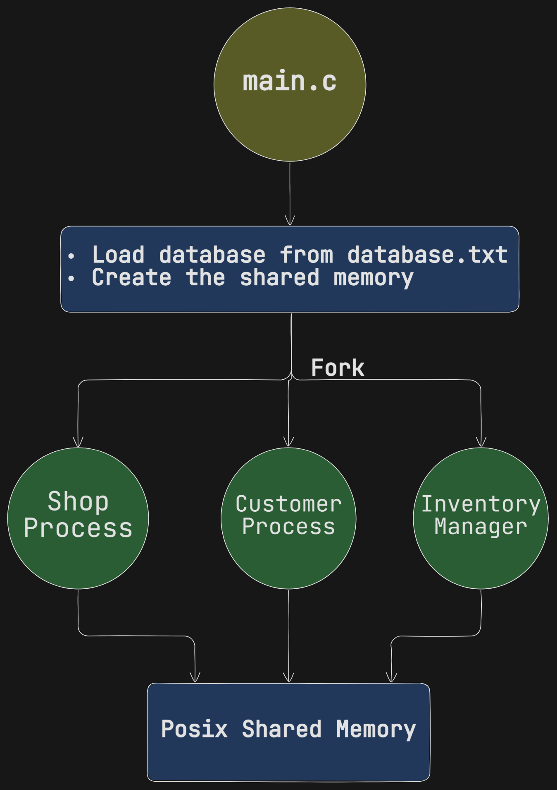

# Cloth Store Application

This application utilizes Inter-Process-Communication techniques like Posix-Shared Memory to implement the store functionality.

the following image illustrates the main flow of the application. the main process will load the initial database from a txt file (database.txt) and then, it creates a shared memory and loads the database to that shared memory. Finally, it forks 3 children processes.

## 1- Shop Process
the smallest process and it periodically prints the content of the store every 8 seconds.


## 2- Customer Process
This is an interactive procecc which will read an input from user ( an integer number ) and based on that value it performs some functionality as illustrated in the following image


 

 ## 3- Inventory Manager Process
 This process is responsible of restocking items in the store. when user asks for restocking in the Customer Process, the Customer process sends a real time signal `SIGUSR1` to the Inventory Manager Process, which will ask for information like item name, price and quantity. Then, it updates the store with the new items and stocks. Finally, it sends a confirmation signal `SIGUSR2` to the Customer process. 

# Database structure
It is a very simple comma separated database:

```
tshirt,250.00,100
jeans,600.00,198
shoes,49.99,1
shirt,6.00,60
```


 # Compilation and running:

 ```bash
 gcc *.c -o output
 ./output
 ```


# User Interface

The user interface is created using Qt and QML. You should install Qt 6.8.2 to run the GUI. It is a very simple GUI and will updated with new features in the future.


